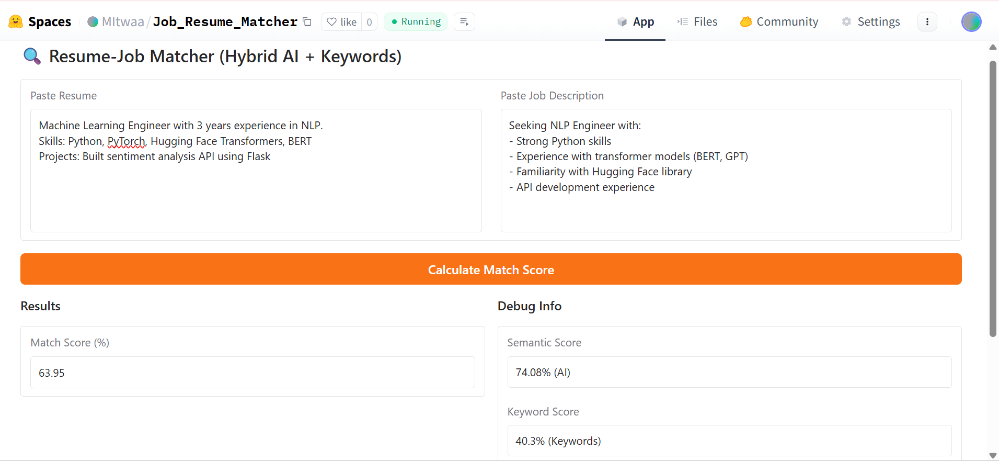

# JobResumeMatcher
An NLP-powered tool to quantify alignment between resumes and job descriptions using semantic + keyword analysis.
# Resume-Job Description Matcher 🔍

[]()
[](https://huggingface.co/spaces/MItwaa/JobResumeMatcher)

An intelligent matching system that quantifies alignment between resumes and job descriptions using **semantic analysis** and **keyword optimization**.

 

## Features ✨

- **Hybrid Scoring Algorithm**:
  - 70% semantic similarity (using `all-mpnet-base-v2` embeddings)
  - 30% keyword overlap (TF-IDF based)
- **Advanced NLP Processing**:
  - Lemmatization & stopword removal
  - Special handling for technical terms (BERT, NLP, etc.)
- **Transparent Debugging**:
  - Real-time score breakdown
  - Keyword matching visualization
- **Production-Ready UI**:
  - Gradio interface
  - Example inputs for quick testing

## Installation ⚙️

```bash
# Clone repository
git clone https://github.com/mitwaaaaaa/JobResumeMatcher.git
cd JobResumeMatcher

# Install dependencies
pip install -r requirements.txt

# Download spaCy model
python -m spacy download en_core_web_sm
